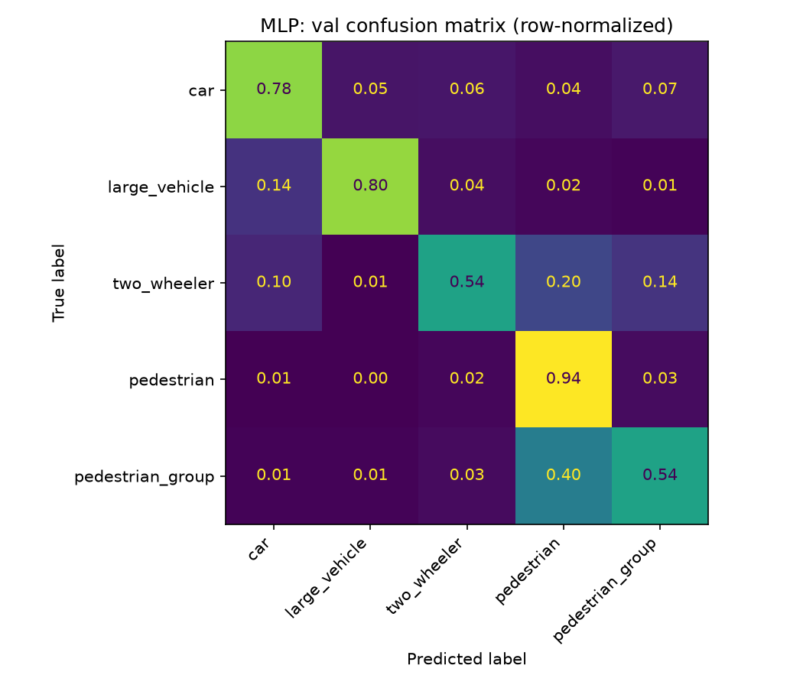
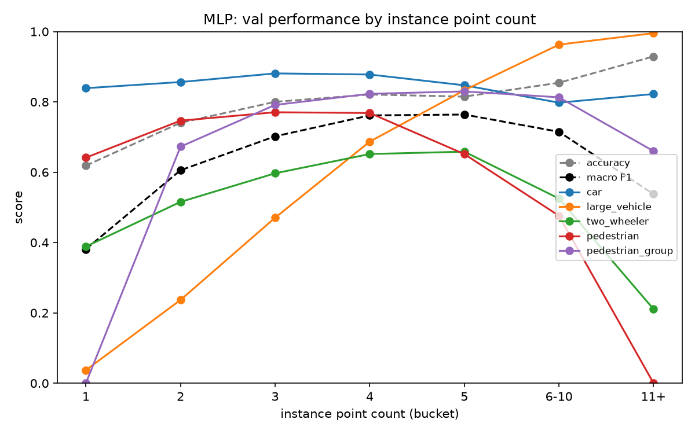
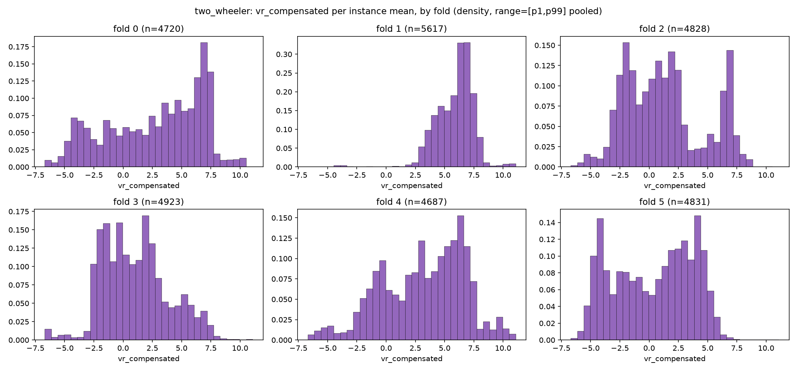
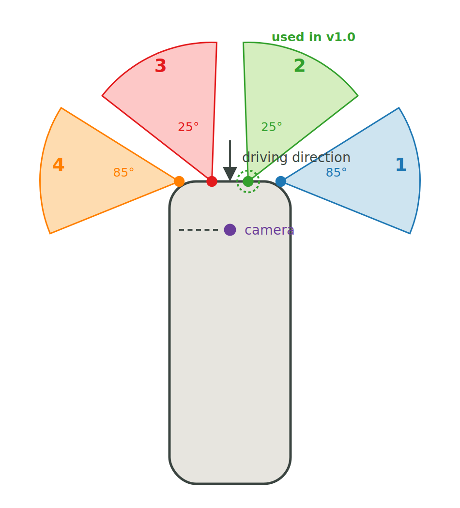
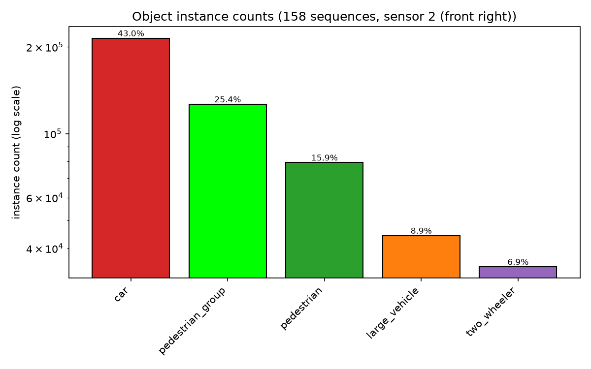

# RadarScenes MLP Classifier: Findings Report (v1.0)

5 class point cloud radar object classifier (`car`, `large_vehicle`, `two_wheeler`, `pedestrian`, `pedestrian_group`) trained on [RadarScenes](https://radar-scenes.com/). In depth writeup: what limits accuracy, what fixes it, whether the split methodology can be trusted, and why the taxonomy is shaped the way it is. Findings below are numbered by rank; every other section is supporting context, not part of that ranking. Full raw experimental log: `notebooks/mlp_ablations.ipynb`.

## Setup

- **Classes**: `car`, `large_vehicle`, `two_wheeler`, `pedestrian`, `pedestrian_group`.
- **Features**: per instance histogram encoding. `rcs`, `vr_compensated`, `x_rel`, `y_rel` each binned into 16 fraction of points bins, plus `doppler_spread` unbinned. 65 dims total. Encoding approach follows Tatarchenko and Rambach, "Histogram-based Deep Learning for Automotive Radar" (arXiv:2303.02975, 2023): point cloud histogram passed through an MLP.
- **Sensor**: [RadarScenes](https://radar-scenes.com/) (Schumann et al., arXiv:2104.02493, 2021) records 4 automotive radar sensors mounted on the front bumper, sensors 1/4 at &plusmn;85&deg; and sensors 2/3 at &plusmn;25&deg; from the driving direction. This project uses sensor 2 (front right, +25&deg;) only, the dataset's own default single sensor choice. Layout diagram under On the data.
- **Model**: 3 layer MLP, 2 hidden layers of 16 units, ReLU.
- **Data**: fixed sequence grouped train/val/test split.
- **Noise floor**: 6 fold split sensitivity check (`split_sensitivity.py`), same 70/15/15 proportions, sequences reassigned. Macro F1 range 0.651 to 0.734 (std 0.027) on baseline config alone. Every result below is evaluated against this range, not a single run.

## Confusion matrix

Row normalized, val set, cached baseline model. `car` and `pedestrian` are the strongest classes, `two_wheeler` the weakest. Mechanisms behind each class's errors: findings 1 and 4 below, synthesized per class at the end.

## Finding 1: sparsity is the primary performance ceiling

- Method: bucket the already trained baseline model's val predictions by instance point count (`evaluate_by_point_count`), no retraining, compared against 14 independently retrained model/feature variants.

| variant | what changed | comment |
|---|---|---|
| `hidden8` / `hidden32` / `hidden64` | `hidden_dim` in {8, 32, 64} vs baseline 16 | more or less capacity, same points per instance |
| `deep10` | depth 10 layers vs baseline 2 (with batch norm) | more depth, same points per instance |
| `range_sc` | `range_sc` in place of `doppler_spread` | different feature, same underlying points |
| `azimuth_extent` | `azimuth_extent` added | extra scalar, no new signal |
| `spatial_extent` | `spatial_extent` in place of `x_rel`/`y_rel` | rotation invariant, still no gain alone |
| `n_points` | `n_points` added as extra scalar | telling the model the count isn't the same as having more points |
| `raw_counts` | raw bin counts in place of fractions | same histogram, different normalization |
| `stat_descriptors` | explicit per instance statistics (mean/median/std of `rcs`, `vr_compensated`, `radial`, `azimuth_sc`, `doppler_spread`) in place of histograms | different encoding of the same points, see below |
| `gaussian_range` / `quantile_bins` | gaussian range / quantile based bin edges | different bin edges, same 65 raw points |
| `rcs_extent_only` | `rcs_extent` added alone | extra scalar, no new signal |
| `spatial_extent_added` | `spatial_extent` added alongside `x_rel`/`y_rel` | extra scalar, no new signal |

All null, every result inside the noise floor above.

- Macro F1: 0.381 at 1 point/instance, 0.764 at 5 points/instance. Same trained model, point count is the only variable.
- `large_vehicle`: F1 0.037 at n=1, 0.995 at n=11+ (62% of val instances have 6+ points). Size is not determinable from a single point.
- `car`: F1 flat at 0.80 to 0.88 across all point counts. RCS and Doppler alone separate it at n=1.
- Conclusion: additional points aggregated per instance (multi scan, multi sensor) address the ceiling directly. Feature or capacity changes at fixed point count mostly do not, with one confirmed exception below.

Worth calling out separately: `stat_descriptors` (explicit per instance statistics, mean/median/std, replacing the 65 dim histogram encoding entirely) is the one variant above that did not just land flat. Macro F1 0.658 vs baseline's 0.686, inside the overall noise floor but only barely, and `pedestrian`'s own f1 dropped outside its class specific noise floor (-0.075 vs a spread of 0.073), the only such case across every variant tested. Why it did not help: histograms and explicit statistics are just two different summaries of the same limited raw points, and the ceiling above is upstream of that choice, how many real points an instance has to begin with, not how those points get encoded. Removing the histogram's binning step entirely and still landing at the same ceiling is itself evidence for that, not against the histogram encoding specifically.

A follow-up complicated that last point, and is now resolved: re-running `stat_descriptors` on `x_rel`/`y_rel`/`vr_compensated`/`rcs` plus `range_sc` instead of `radial`/`azimuth_sc` (`stat_descriptors_5features`/`maxad_stats_5features`) cleared baseline, and a 16-bin quantile histogram on the same 5 features (`quantile_bins_5features`) landed in the same neighborhood, so it isn't statistics beating histograms, it's `range_sc` itself. Run through the same 6-fold split-sensitivity check used for `combined_features` below: all four encodings (equal-width histogram, quantile histogram, raw mean/median/std, raw median/maxAD) beat baseline in 6/6 folds, mean delta +0.02 to +0.03 macro F1, delta std 0.007-0.009. Confirmed real, not noise, and encoding-invariant. This is a second validated positive result alongside `combined_features`, and the one genuine exception to this section's fixed-point-count conclusion. Full tables, per-class breakdown, and how this compares to DeepReflecs' further architecture-only effect on top of it: `model_comparison.md`.

## Finding 2: one validated positive result, combined_features

- Every variant in finding 1's table, tested in isolation, fell inside the noise floor.
- Method: `combined_features` stacks all of them additively onto baseline (102 dims vs 65, nothing removed), evaluated via the same 6 fold split sensitivity procedure, paired fold by fold against baseline (sign test for a non chance win rate).

| fold | baseline F1 | combined_features F1 | delta |
|---|---|---|---|
| 0 | 0.679 | 0.708 | +0.029 |
| 1 | 0.734 | 0.775 | +0.041 |
| 2 | 0.701 | 0.738 | +0.037 |
| 3 | 0.651 | 0.701 | +0.050 |
| 4 | 0.695 | 0.734 | +0.039 |
| 5 | 0.688 | 0.706 | +0.018 |

- Wins 6/6 folds, mean delta +0.036 macro F1. P(6/6 by chance, assuming equivalence) approx 1.6%.
- Gain concentrated in `two_wheeler` and `pedestrian_group`. `large_vehicle` (finding 1's sparsity casualty) shows no gain.
- Magnitude: approximately 1/10 of finding 1's effect size. Independent, additive signal, not a reduction of the sparsity ceiling.
- Why: no single feature helped alone, but together they add information the model didn't have before. `spatial_extent` captures instance size regardless of orientation. `doppler_spread` captures how much the points inside one instance differ in speed, relevant for objects with moving parts, a cyclist's legs, several people in a group. `two_wheeler` and `pedestrian_group` are exactly those classes. Most likely explanation, not a confirmed causal test like findings 1 and 4.

## Finding 3: DeepReflecs point-set network, feature choice vs architecture

- `DeepReflecs` (Ulrich, Glaser and Timm, arXiv:2010.09273, 2021, reimplemented: shared per-point layers, global max-pool context, no fixed-length encoding) trained on the same `x_rel`/`y_rel`/`vr_compensated`/`rcs`/`range_sc` feature set as finding 1's `range_sc` result, same 6 fold split sensitivity procedure.
- Mean macro F1 0.735 vs baseline's 0.692 (+0.044, wins 6/6 folds).
- Decomposes into two independently validated pieces: `range_sc` alone, on any of the four MLP encodings, accounts for +0.031; the point-set architecture on top of that, paired directly against `quantile_bins_5features` on the identical feature set and folds, accounts for a further +0.012 (6/6 wins).
- So most of DeepReflecs' advantage over baseline is the missing feature, not the network. Per class, the architecture-only effect is reliably real for `car` alone; `pedestrian_group`'s gain is entirely the feature effect, architecture there is a slight net negative.
- Full tables, per-class real-vs-noise verdicts: `deepreflecs.md`, `model_comparison.md`.

## Finding 4: sequence level correlation inflates apparent split variance

- `StratifiedGroupKFold` matches instance count ratios per split but cannot split a sequence. A class whose instance count is concentrated in few sequences has its val distribution set by which of those sequences are assigned to val, independent of the overall ratio.
- Mechanism, traced for `two_wheeler` (largest fold to fold F1 spread in the project, 0.386): a single tracked object detected across many consecutive scans (e.g. a stationary or idling cyclist) generates hundreds of correlated instances under one sequence.
- Method: pairwise KS statistic computed between every pair of the 6 split sensitivity folds' per instance feature distributions (`rcs`, `vr_compensated`, `x_rel`, `y_rel`, `spatial_extent`, `doppler_spread`). Causal claim confirmed by retraining baseline with `vr_compensated` removed, across the same 6 folds. Different question from the confusion mechanism below: not why `two_wheeler` is confused with `pedestrian`, why its score varies fold to fold regardless of confusion target.

- `vr_compensated`, the model's highest weighted feature (zero out importance drop -0.331, next highest -0.080), shows the largest cross fold KS statistic for `two_wheeler` (mean 0.370). Its instability propagates directly into F1 instability.
- Causal check: retraining without `vr_compensated` narrows `two_wheeler`'s fold to fold F1 spread from 0.386 to 0.133.

## Per class error mechanism

Per class view of how findings 1 and 4 actually show up in the confusion matrix above. Method: separability probes (logistic regression + random forest, sparse n<=2 vs dense n>=5 point regimes), two sample Kolmogorov-Smirnov (KS) test per raw feature, grouped permutation importance on the histogram encoding, softmax confidence margin on real predictions, and zero out ablation importance on the combined_features model. No additional model retrained for this section.

**`car` -> `large_vehicle`** (73% correct, 10% predicted `large_vehicle`):

| regime | probe AUC | dominant KS feature | KS value | real confusion rate |
|---|---|---|---|---|
| sparse (n<=2) | 0.61 | `rcs` | 0.125 | 5.3% |
| dense (n>=5) | 0.98 | `x_rel` | 0.277 | 9.2% |

Dense is far more separable by probe AUC but shows the higher real error rate. Not explained by the top KS feature itself: misclassified cars carry roughly half the decision margin of confident calls (median softmax margin 0.15 to 0.30 vs 0.47 to 1.0), and are anomalously wide relative to their own class (`y_extent`/`spatial_extent` elevated toward `large_vehicle` scale). Sparse regime overlap is genuine, misclassified car `rcs` sits at car's own upper tail, reaching into `large_vehicle`'s typical range.

**`large_vehicle`**: covered under finding 1, sparsity ceiling, not a separability or confidence issue.

**`two_wheeler` <-> `pedestrian`** (`two_wheeler`'s lowest recall of any class):

| metric | value |
|---|---|
| `two_wheeler` predicted as `pedestrian` | 20 to 24% |
| `pedestrian` predicted as `two_wheeler` | 1 to 2% |
| `vr_compensated` zero out F1 drop | -0.331 |
| next highest feature drop (`spatial_extent`) | -0.080 |
| local density ratio, pedestrian:two_wheeler at `vr_compensated` approx 0, sparse | approx 12:1 |
| same ratio, dense | approx 1:1 |

`vr_compensated` dominates the model but reads near zero for both a stationary pedestrian and an idling or tangentially moving `two_wheeler`. Local instance density at that value favors `pedestrian` roughly 12:1 in sparse, so a true `two_wheeler` there is outvoted. Confusion is one directional since `pedestrian` has near zero mass in `two_wheeler`'s higher speed range. Same feature as finding 4, different question: there it explains cross fold score variance, here it explains the confusion itself.

**`pedestrian`**: highest recall of any class (0.886 val, 0.928 test), the direct counterpart of the row above. Residual confusion is with `pedestrian_group`, not `car` or `two_wheeler`: modest and non monotonic with point count, 2.3% predicted as `pedestrian_group` at 1 to 2 points, 8.0% at 3 to 5, 4.1% at 6 to 10. True pedestrian instances almost never reach higher point counts (49 at 6 to 10, none at 11+), so there isn't enough data to say whether the rate keeps rising.

**`pedestrian_group`**: confused as `pedestrian` at low point count, sparsity again, a sparse group and an isolated pedestrian look similar with few points to work with. Part of this is likely a label boundary problem rather than a model or data limitation: what instance count or spacing turns individual pedestrians into a "group" is not sharply defined in the source annotations, so some of this confusion may reflect a genuinely ambiguous ground truth rather than a separability gap the model could close.

## Confirmation: held out test set

- Method: `evaluate_test_metrics` on the cached baseline model, computed once, after all tuning concluded. Test set untouched through every prior training, tuning, and ablation step.
- Test macro F1: 0.699. Val macro F1: 0.686. Delta +0.013, inside the 0.651 to 0.734 noise floor.
- No overfitting detected. `two_wheeler` shows the largest val to test delta, consistent with its fold to fold instability (finding 4).

## On the data

- Root cause behind findings 1 and 4 is the same: RadarScenes is a naturalistically collected, fixed dataset. Common classes get broad incidental coverage, rare classes and rare subtypes do not. No amount of splitting or modeling fixes thin coverage that was never collected. `car` and `pedestrian_group` alone make up most of train, `two_wheeler` is the smallest of the five final classes.
- `large_vehicle` groups `large_vehicle`, `truck`, `train`, and (after a later revisit) `bus`, following RadarScenes' own recommended `ClassificationLabel` scheme, not an ad hoc merge. Two reasons forced it: `train` has only 57 raw instances, all inside one sequence, impossible to split into train/val without leakage; a held out probe found `large_vehicle`/`truck` pairwise separability near chance (AUC 0.632, 74% confused as each other), confirmed at proper cross validation (`large_vehicle` alone: precision 0.24, recall 0.29, barely usable, only 23 of 158 sequences ever contain one). `bus` was initially kept separate on mixed evidence, but the real MLP's confusion matrix later showed it heavily confused with `large_vehicle` anyway, merging raised the combined class's F1 to 0.756, above either `bus` (0.543) or `large_vehicle` (0.492) alone.
- `two_wheeler`'s instability (finding 4) has a second contributing factor beyond sequence concentration: it merges two physically different velocity regimes (`bicycle`, `motorized_two_wheeler`, the latter only 4.7% of `two_wheeler` instances), a taxonomy simplification, not a data defect. Mixed evidence on how much this specifically drives the instability, sequence concentration through `vr_compensated` (finding 4) remains the better supported explanation.
- Practical read: `two_wheeler` does not need a better model, it needs more independent sequences and richer point counts per instance for that specific class. Findings 1 and 4 are two symptoms of the same underlying data gap, not separate problems.

## Next step

- Finding 1 (sparsity) is the largest unaddressed lever. Direction: aggregate a tracked object's points across multiple scans instead of classifying single scan instances independently. Attacks sparsity at the input level rather than the encoding. Untested, proposed as v1.1.

## Full writeup

`notebooks/mlp_ablations.ipynb` (executed ablation program) for maximum depth. This document and `notebooks/mlp_report.ipynb` sit in between.

## References

O. Schumann et al., "RadarScenes: A Real-World Radar Point Cloud Data Set for Automotive Applications," arXiv:2104.02493, 2021. [https://arxiv.org/abs/2104.02493](https://arxiv.org/abs/2104.02493)

M. Tatarchenko and K. Rambach, "Histogram-based Deep Learning for Automotive Radar," arXiv:2303.02975, 2023. [https://arxiv.org/abs/2303.02975](https://arxiv.org/abs/2303.02975)

M. Ulrich, C. Glaser and F. Timm, "DeepReflecs: Deep Learning for Automotive Object Classification with Radar Reflections," arXiv:2010.09273, 2021. [https://arxiv.org/abs/2010.09273](https://arxiv.org/abs/2010.09273)
