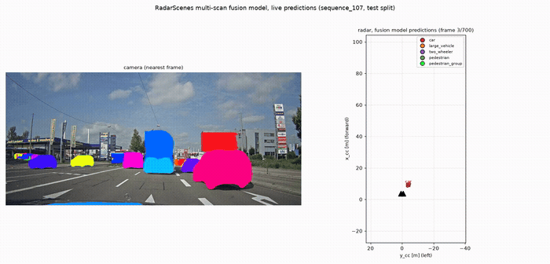

# radar-ml-autonomous-driving

5-class point cloud object classifier (`car`, `large_vehicle`, `two_wheeler`,
`pedestrian`, `pedestrian_group`) on the [RadarScenes](https://radar-scenes.com/)
dataset (158 sequences, 4 radar sensors + camera + odometry, point-wise labels).

## Abstract

A single radar detection instance (one object, one scan) averages only ~2.9 points,
too sparse for reliable classification regardless of encoder: a DeepReflecs
point-set classifier trained on single scans (all 4 sensors) reaches 0.7370 macro
F1, a sparsity ceiling, not a model capacity one. Accumulating a tracked object's
points across its last N radar scans instead of classifying each scan in isolation
attacks that ceiling directly: a naive pooled baseline (N=20 scans, all sensors, no
notion of scan order) already reaches 0.8613 macro F1 from more points per decision
alone. The best result, 0.8897 macro F1, adds a causal GRU that consumes the
sequence of per-scan embeddings directly, fused with the order-blind pooled
embedding through a small trained classifier head. Every design choice behind these
numbers is backed by a validated experiment, see "Where to start reading" below.

## Headline results

| stage | macro F1 | what changed |
|---|---|---|
| Single-scan (DeepReflecs, all sensors) | 0.7370 | one scan's own points only |
| Multi-scan pooled baseline (N=20, all sensors) | 0.8613 | pool the last 20 scans' points, no sequence model |
| + GRU over per-scan embeddings | 0.8895 | causal sequence model on frozen per-scan embeddings |
| + fusion (pooled + GRU) | **0.8897** | concatenate both views, small trained head |




Full writeup, single-scan through multi-scan, with confusion-matrix interpretation
and ablations: `final_report.md` (renders directly on GitHub) or `notebooks/final_report.ipynb`.

## Setup

```bash
python3 -m venv .radar_ml
source .radar_ml/bin/activate
pip install -r requirements.txt
```

- Data expected at `data/RadarScenes/RadarScenes/data/sequence_<N>/` (`radar_data.h5`,
  `scenes.json`, `camera/` per sequence).

## Quick start: single-scan baseline (MLP)

```bash
python3 scripts/build_points_table.py   # {points, attributes, label} instance table
python3 scripts/sequence_split.py       # fixed, sequence-grouped train/val/test split
python3 scripts/mlp_classifier.py       # trains (or loads cached) baseline MLP, writes to results/mlp/
```

- Every step is cached, safe to re-run.
- `mlp_classifier.py` always trains/evaluates the standing baseline config. To run a
  different variant (feature set, architecture, taxonomy), use `mlp_variants.py` instead:

```bash
python3 scripts/mlp_variants.py                     # defaults to baseline, same result as mlp_classifier.py
python3 scripts/mlp_variants.py combined_features    # any variant name from MLP_CONFIG.json
python3 scripts/mlp_variants.py deep10
```

- Variant names are the `"variants"` keys in `MLP_CONFIG.json` (e.g. `baseline`,
  `bus_separate`, `range_sc`, `hidden32`, `deep10`, `combined_features`). Each caches its
  training/eval under its own `output_dir`, so running a variant never overwrites the
  baseline's results.

## Quick start: multi-scan accumulation (DeepReflecs + GRU + fusion)

One script runs all three stages in order (pooled baseline -> GRU -> fusion), each
as its own subprocess so memory is released between stages (the pooled-baseline
windowed point sets at this scale are too large to keep several stages' worth
resident in one process on a 12GB machine):

```bash
python3 scripts/run_multiscan_pipeline.py             # N=20, all sensors (the headline result)
python3 scripts/run_multiscan_pipeline.py 10 sensor2   # N=10, single sensor
python3 scripts/run_multiscan_pipeline.py 50 all       # N=50, all sensors
```

- First argument: `N`, how many scans get pooled/accumulated per decision.
- Second argument: `all` (all 4 sensors, cross-sensor handoff) or `sensor2` (single
  sensor only). Defaults to `all`.
- Each stage's model/metrics are written under `results/track_accumulation/` (pooled
  baseline) and `results/track_accumulation_rnn/` (GRU, fusion), keyed by `N` and
  sensor scope, so different configurations never clobber each other.
- Only the GRU stage skips retraining when its exact config is already cached. The
  pooled-baseline and fusion stages always retrain from scratch on every run (large,
  cached point-set arrays aren't checked at that step), so rerunning this script
  overwrites those two stages' results and, since GPU training isn't bit-deterministic,
  lands within roughly +/-0.002 macro F1 of the numbers quoted in this README and
  `notebooks/final_report.ipynb` rather than reproducing them exactly.

## Where to start reading

1. `final_report.md` (or `notebooks/final_report.ipynb`, same content): single-scan
   through multi-scan, one document, abstract and headline results up front,
   confusion-matrix interpretation, brief ablations, conclusions and future work.
   Start here.
2. `Design_Decisions.md`: taxonomy, encoding, and split decisions behind the
   single-scan baseline, with evidence.
3. `single_scan_final_report.md`: in-depth writeup of the single-scan MLP ablation program,
   per-class error mechanisms, methodology notes.
4. `deepreflecs.md` / `model_comparison.md`: DeepReflecs vs. the baseline MLP, and a
   4-way encoding comparison, both cross-validated.

`notebooks/data_analysis.ipynb`, `notebooks/feature_distributions.ipynb`,
`notebooks/mlp_classifier.ipynb`, `notebooks/mlp_report.ipynb` are the supporting
EDA/modeling notebooks behind points 2-4 above.

## Layout

```
scripts/             data loading, table building, plotting, separability probes,
                      MLP classifier, DeepReflecs single-scan/multi-scan/GRU/fusion
notebooks/           EDA, MLP, and multi-scan report notebooks
results/             generated plots + cached tables (gitignored, a few figures allow-listed)
data/                the RadarScenes dataset (gitignored)
Design_Decisions.md               taxonomy/encoding/split decisions and evidence
single_scan_final_report.md       in-depth single-scan MLP writeup
deepreflecs.md                    DeepReflecs vs. baseline MLP, cross-validated
model_comparison.md               baseline vs. range-extended encodings vs. DeepReflecs
MLP_CONFIG.json                   every trained MLP variant's config
visualize.sh          rad_viewer launcher
```

## Scripts

- **`dataloader.py`**: loads/plots one scene at a time (h5py, no heavy deps); `inspect_scene()` is the entry point; `CLASS_GROUPS` is the raw-to-training-class taxonomy map. `python3 scripts/dataloader.py`
- **`build_points_table.py`**: builds the `{points, attributes, label}` instance table. Sensor 2 only by default; pass `sensor_id=None` for all 4 sensors (cross-sensor handoff). `python3 scripts/build_points_table.py`
- **`class_imbalance.py`**: plots per-class instance counts. `python3 scripts/class_imbalance.py`
- **`taxonomy_separability.py` / `separability_probe.py`**: LR + RF separability probe (sequence-grouped CV) behind the `large_vehicle`/`truck`/`bus` merge decision (`Design_Decisions.md` decision 1). `python3 scripts/taxonomy_separability.py`
- **`sequence_split.py`**: fixed ~70/15/15 sequence-grouped train/val/test split, cached to `results/data/sequence_split.json`. `python3 scripts/sequence_split.py`
- **`feature_distributions.py` / `histogram_separability.py`**: picks the histogram encoding's bin range/count via separability-probe CV, not visual inspection. `python3 scripts/feature_distributions.py`, `python3 scripts/histogram_separability.py`
- **`batch_size_selection.py`**: picks batch size + learning rate from train-split class frequencies (rare-class per-batch miss probability). `python3 scripts/batch_size_selection.py`
- **`mlp_classifier.py`**: the baseline single-scan MLP (65->16->16->5), cached training/eval; architecture and findings in `single_scan_final_report.md`. `python3 scripts/mlp_classifier.py`
- **`MLP_CONFIG.json` / `mlp_variants.py` / `class_taxonomy_experiment.py`**: registry of every trained MLP variant (see "Quick start" above for how to run one), and the taxonomy ablation that led to the `bus`/`large_vehicle` merge. `python3 scripts/mlp_variants.py <variant>`
- **`split_sensitivity.py`**: how much macro F1 depends on split choice alone; the noise floor every other ablation is judged against. `python3 scripts/split_sensitivity.py`
- **`pedestrian_separability.py`**: sparse-vs-dense separability probe for the `pedestrian`/`two_wheeler` pair, see `single_scan_final_report.md`.
- **`deepreflecs_classifier.py`**: single-scan DeepReflecs point-set classifier (`deepreflecs.md`). `python3 scripts/deepreflecs_classifier.py`
- **`deepreflecs_track_accumulation.py`**: multi-scan point pooling (windowed DeepReflecs), the naive baseline `run_multiscan_pipeline.py` builds on.
- **`deepreflecs_rnn_track_accumulation.py`**: per-scan embeddings, GRU, and fusion (pooled + GRU); see "Quick start: multi-scan accumulation" above.
- **`run_multiscan_pipeline.py`**: runs the full multi-scan pipeline (pooled baseline -> GRU -> fusion) for a given `N`/sensor scope in one command; see "Quick start" above.
- **`visualize.sh`**: official `rad_viewer` Qt GUI for a full sequence, heavier (PySide6 + pyqtgraph), kept as an occasional inspection tool. `./visualize.sh [sequence_number]` (WSL2 without WSLg needs a Windows-host X server and `libxcb-cursor0`).
