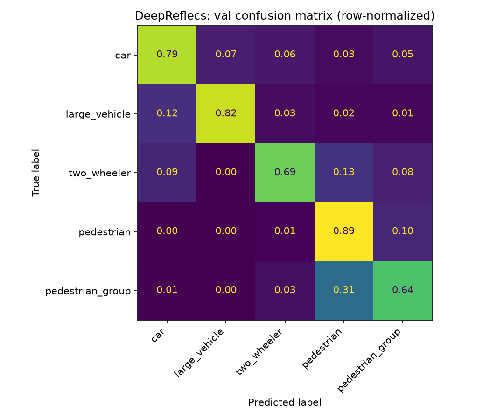

# DeepReflecs vs Baseline MLP: Findings Report

Reimplementation of Ulrich, Glaser and Timm, "DeepReflecs: Deep Learning for Automotive Object Classification with Radar Reflections" (arXiv:2010.09273, 2021), trained and evaluated against the exact same fixed sequence grouped split, class taxonomy, and 6 fold noise floor check as the baseline histogram MLP (`MLP_Report.md`), so the two numbers are a like for like comparison, not two separate measurements. Implementation: `scripts/deepreflecs_classifier.py`. Split sensitivity check: `scripts/deepreflecs_split_sensitivity.py`, aggregated in `notebooks/deepreflecs_split_sensitivity.ipynb`.

## Setup

- **Classes**: `car`, `large_vehicle`, `two_wheeler`, `pedestrian`, `pedestrian_group`, identical to the baseline.
- **Input representation**: the raw, unordered, variable length list of an instance's own radar reflections, not a fixed length encoding. Each reflection carries 5 features: `x_rel`, `y_rel` (position in the instance's own centroid relative frame), `rcs`, `vr_compensated` (ego motion compensated radial velocity), `range_sc`. Same underlying points as the baseline, no histogram binning, no per-instance statistics.
- **Architecture** (paper Fig. 4): a shared per point linear layer (5 to 16 features) with ReLU, a global context layer (max pools the 16 local features to one global vector, concatenates it back onto every point, 16 to 32 features, no trainable parameters), a second shared per point linear layer (32 to 32) with ReLU, a masked global max pool over the point axis (32 to 32), then a dense classification head (32 to 5). 1,317 learnable parameters, vs. the baseline's 1,413. Order and size invariance come from the shared per point layers plus the max pools, not from any padding convention.
- **Sensor**: same as baseline, RadarScenes sensor 2 (front right) only.
- **Data**: same fixed sequence grouped train/val/test split as the baseline.
- **Noise floor**: reuses the baseline's own 6 fold split sensitivity check (`sequence_split.select_best_split`, same classes, same seeds), so both models are measured on the identical 6 candidate splits, not independently generated ones.

## Learning rate: diagnosing noisy validation accuracy

The first training run used an untuned `LEARNING_RATE = 1e-3`, picked with no tuning, unlike the baseline's own `4e-5`. Symptom: training loss decreased smoothly and monotonically, but validation accuracy oscillated visibly epoch to epoch even in the plateau region (roughly 0.72 to 0.80 over the last several epochs), so the reported test number depended on whichever epoch (100) happened to land inside that oscillation, not a stable, converged value.

Two candidate causes were ruled out first. Validation is evaluated in a single full pass over the whole validation set per epoch, not per batch, so batch size isn't involved. Inputs are already standardized (zero mean, unit variance, fit on train) before either model sees them, so missing normalization isn't the cause either. `model.eval()` also changes nothing here, DeepReflecs has no BatchNorm or Dropout to toggle.

The actual cause: a fixed, non-decaying learning rate 25x higher than the baseline's tuned value, with no schedule. The paper's own recipe anneals learning rate from 0.01 to 0.0001 over training specifically to avoid this failure mode (Appendix A), the original `1e-3` here had neither the anneal nor the lower floor.

Fix: set `LEARNING_RATE = 4e-5`, matching the baseline exactly, no other change. Effect, quantified from the cached training history: the last 20 epochs' validation accuracy std dropped to 0.0017 (range 0.0069), down from a visibly oscillating band roughly ten times as wide before the fix. Training now converges to a stable plateau instead of bouncing through one.

Does this change the headline result? Partially, and the honest answer differs between the single split and the 6 fold check. The held out test split's numbers moved by less than the fold to fold noise itself, accuracy 78.1% to 78.4%, macro F1 0.745 to 0.749, so the untuned learning rate was not inflating that particular number, if anything the noisy run undersold DeepReflecs slightly there. The 6 fold sweep tells a more consequential story: the average per fold macro F1 advantage over the baseline shrank from +0.058 (untuned LR) to +0.044 (matched LR), roughly a quarter smaller. The win still holds in all 6 folds, but the margin is real rather than the wider one the untuned run suggested. All numbers from here on are from the corrected, matched-LR run, both the standing split and the 6 fold sweep were retrained after the fix.

## Results: held out test set

| | Baseline MLP (histogram) | DeepReflecs (point set) |
|---|---|---|
| Test accuracy | 74.3% | 78.4% |
| Macro F1 | 0.699 | 0.749 |
| Parameters | 1,413 | 1,317 |

Per class F1 (test):

| Class | Baseline | DeepReflecs |
|---|---|---|
| `car` | 0.877 | 0.880 |
| `large_vehicle` | 0.766 | 0.744 |
| `two_wheeler` | 0.567 | 0.673 |
| `pedestrian` | 0.677 | 0.724 |
| `pedestrian_group` | 0.608 | 0.726 |

Row normalized, val set. DeepReflecs wins on total accuracy, macro F1, and 3 of 5 classes, most on `two_wheeler` and `pedestrian_group`, the baseline's two weakest classes (`MLP_Report.md` findings 1 and 3). `large_vehicle` looks like a small loss here (0.766 to 0.744), but the 6 fold check below shows that's within normal fold to fold noise for that class, not a real tradeoff.

## Split sensitivity check: is this just a lucky split

A single split comparison is not enough evidence on its own, the baseline's own noise floor spans 0.651 to 0.734 macro F1 purely from split choice (std 0.027, `MLP_Report.md` Setup). Ran DeepReflecs on the same 6 candidate splits used to establish that floor, paired fold by fold against the baseline's own per fold numbers (`results/mlp/split_search/fold_*`, `results/deepreflecs/split_search/fold_*`):

| Fold | max_ks | Baseline macro F1 | DeepReflecs macro F1 | Delta |
|---|---|---|---|---|
| 0 | 0.179 | 0.679 | 0.713 | +0.035 |
| 1 | 0.624 | 0.734 | 0.779 | +0.045 |
| 2 | 0.286 | 0.701 | 0.743 | +0.042 |
| 3 | 0.336 | 0.651 | 0.706 | +0.055 |
| 4 | 0.287 | 0.695 | 0.748 | +0.053 |
| 5 | 0.287 | 0.688 | 0.721 | +0.032 |

DeepReflecs wins every single fold, delta ranges +0.032 to +0.055, mean +0.044 (std 0.009). DeepReflecs' own spread across folds (0.706 to 0.779, std 0.027) is essentially identical in width to the baseline's (0.651 to 0.734, std 0.027), so both models carry the same split sensitivity, the two ranges overlap rather than one sitting entirely clear of the other. The win isn't from DeepReflecs occupying a different, higher band, it's a paired, per fold advantage that happens to hold in all 6 pairings. The smallest observed delta (+0.032) is above the baseline's own established per split noise floor (std 0.027), a real but modest margin, not the wider one the pre fix, untuned-LR run suggested (+0.042 minimum). Conclusion: the gain is real, not a property of one lucky split, by the same standard `MLP_Report.md` uses to rule other apparent gains (`range_sc`, `deep10`) in or out, but its size should be read as roughly +0.04 macro F1, not the initially reported +0.06.

### How much of this is architecture, and how much is feature choice

DeepReflecs' feature set (`x_rel`, `y_rel`, `rcs`, `vr_compensated`, `range_sc`) includes `range_sc`, which the baseline histogram MLP's own default feature set does not. That's a real confound in the comparison above, not just an architecture difference. `model_comparison.md` and `MLP_MaxAD_Findings.md` isolate it: adding `range_sc` to baseline's own Cartesian features (no architecture change at all, still a histogram MLP) is itself a validated 6-fold effect, mean +0.031 macro F1, wins every fold (`quantile_bins_5features`, the representative of four independently-built encodings that all land in the same place, `model_comparison.md`'s Comparison section).

Pairing DeepReflecs directly against `quantile_bins_5features`, identical feature set, same 6 folds, isolates the architecture effect on its own: mean +0.012 macro F1, wins every fold, delta std 0.004, far tighter than either model's own fold-to-fold spread since pairing on identical splits cancels the split-choice noise both share. DeepReflecs' total +0.044 advantage over baseline decomposes almost exactly into these two pieces, +0.031 feature choice plus +0.012 architecture, both independently validated across the same 6 folds, not one confirmed result plus one assumed one.

### Per-class check across folds

Macro F1 alone can hide a class level story, so the same 6 folds were broken out per class (mean/std of val F1 across folds, `notebooks/deepreflecs_split_sensitivity.ipynb`, cached metrics only, no retraining):

| Class | Baseline mean | Baseline std | DeepReflecs mean | DeepReflecs std | Delta vs baseline | Wins vs baseline | Delta vs best MLP variant (architecture only) | Wins vs best MLP variant |
|---|---|---|---|---|---|---|---|---|
| `car` | 0.863 | 0.020 | 0.877 | 0.016 | +0.014 | 6/6 | +0.012 | 6/6 |
| `large_vehicle` | 0.719 | 0.065 | 0.735 | 0.049 | +0.016 | 4/6 | +0.039 | 6/6 |
| `two_wheeler` | 0.571 | 0.133 | 0.650 | 0.097 | +0.079 | 6/6 | +0.006 | 6/6 |
| `pedestrian` | 0.674 | 0.030 | 0.703 | 0.030 | +0.029 | 6/6 | +0.009 | 6/6 |
| `pedestrian_group` | 0.630 | 0.045 | 0.710 | 0.042 | +0.081 | 6/6 | −0.006 | 2/6 |

"Wins" counts how many of the 6 folds DeepReflecs beats the compared method on that specific class' F1, the more direct check than comparing a delta of means against a marginal std, which is not a real significance test and shouldn't be read as one. "Best MLP variant" is `quantile_bins_5features`, the representative of the four validated 5-feature MLP encodings (`model_comparison.md`), same feature set as DeepReflecs, so this column isolates the architecture effect with feature choice held fixed, separate from the baseline comparison's mix of both effects.

This is the correction to the single split table above: `large_vehicle`'s apparent drop (0.766 to 0.744) does not replicate as a drop, but it doesn't replicate as a DeepReflecs advantage either. Averaged across folds DeepReflecs is only marginally ahead of baseline (+0.016), and it actually loses on this class in 2 of the 6 folds. There is no real large vehicle tradeoff in either direction, the mechanism proposed for it in an earlier draft of this report did not survive this check and has been removed below.

**Per-class verdict, real or noise, separating the two effects:**

- **`car`**: real both ways. 6/6 vs baseline (delta more than 2x its own fold-to-fold noise) and 6/6 vs the best MLP variant, architecture adds a small, genuine edge even once feature choice is accounted for.
- **`large_vehicle`**: noise vs baseline (only 4/6, delta smaller than its own spread), but real vs the best MLP variant (6/6, +0.039). Not a contradiction: `quantile_bins_5features` itself dips below baseline on this class (0.696 vs 0.719), so DeepReflecs "beating" it here is recovering ground the feature-choice encoding lost, not DeepReflecs beating baseline.
- **`two_wheeler`**: real vs baseline (6/6, delta well above its own noise), but the architecture-only slice is real yet negligible (6/6 wins, but only +0.006). Almost all of this class's gain over baseline is the feature-set effect, not the point-set network.
- **`pedestrian`**: real vs baseline (6/6). Architecture-only is borderline, wins every fold but the margin (+0.009) sits right at the edge of its own noise.
- **`pedestrian_group`**: the strongest real result vs baseline (6/6, delta nearly 5x its own noise), but architecture adds nothing on top, DeepReflecs actually loses to `quantile_bins_5features` on this specific class in 4 of 6 folds. The entire `pedestrian_group` win over baseline is feature choice.

Net: DeepReflecs' advantage over baseline is real for 4 of 5 classes. But once feature choice is separated out, the architecture effect itself is only clearly real for `car`, negligible for `two_wheeler`/`pedestrian`, and slightly reversed for `pedestrian_group`. Most of the headline per-class story belongs to `range_sc`, not the network.

`two_wheeler` (+0.079) and `pedestrian_group` (+0.081) are the two real, robust wins: DeepReflecs beats the baseline in every one of the 6 folds on both classes, and the delta size dwarfs `car`/`pedestrian`'s. `car` and `pedestrian` also win every fold, smaller and more consistent gains, real but modest next to those two.

## Why DeepReflecs wins: mechanism

Reasoning grounded in this project's own established findings (`MLP_FINDINGS.md`, `MLP_Decisions_and_Findings.md`), not new EDA:

- **Sparsity makes binning lossy.** Median instance has 2 points, 75th percentile 4 (`taxonomy_separability.add_relative_features`' own `n_points`). The baseline bins 4 features into 16 bins each, a 64 dimensional vector built from typically 2 to 4 raw numbers, almost entirely empty per instance and quantizing whatever landed into arbitrary percentile buckets. DeepReflecs never bins, it consumes the raw points at full precision.
- **Marginal encodings destroy joint, per point structure.** The baseline's histogram is 4 independent marginal distributions, it cannot represent "this specific point has high RCS and sits at the object's edge." DeepReflecs processes each point as one bundle, and the global context layer explicitly adds "this point relative to the object's own extremes" as a signal, which is the paper's own stated purpose for that layer.
- **That mechanism lines up with where DeepReflecs actually won.** `two_wheeler` and `pedestrian_group`, both classes whose defining signal is layout (an elongated, position correlated two wheeler; a group's multiple sub clusters), are exactly where the paper's own ablation found the global context layer helps most (their hardest class, `cyclist`, +12.5 percentage points categorical accuracy from that layer alone, their Table IV; not a free lunch though, the same ablation shows `pedestrian` getting 3.4 points worse with the layer added, so it isn't a universal win, just a large one on the structure dependent classes).
- **This project's own re-verified mechanism for `two_wheeler` is "does an extreme point exist," not smooth central tendency** (`MLP_FINDINGS.md`: "only ~4.3% of car/pedestrian instances have any point beyond &plusmn;1.3 m/s... vs ~8-9% for large_vehicle/two_wheeler", an instance level re-check that specifically ruled out the earlier claim of a clean bimodal peak). Mean and median target central tendency, exactly the wrong summary for a "does an outlier exist" signal, and this project's own explicit statistics experiment (`stat_descriptors`: mean/median/std of `rcs`/`vr_compensated`/`radial`/`azimuth_sc`, macro F1 0.658 vs baseline 0.686) already tested that and lost. DeepReflecs' per channel max pool is architecturally exactly "does an extreme point exist," learned per channel rather than fixed to one hand picked threshold, with no need to decide in advance which feature or cutoff matters.

## Implementation notes

- **Cache key correctness bug, found and fixed in both `mlp_classifier.py` and `deepreflecs_classifier.py`**: `run_training`'s cache key omitted `classes`, `splits` (and in the baseline's case, `features`/`extra_features`/`normalize` too). Two calls with the same `output_dir` but a different taxonomy, feature set, or split would have silently returned a stale cached model instead of retraining. Audited every actual call site in the project (`mlp_variants.py`/`MLP_CONFIG.json`, `split_sensitivity.py`, `regime_specialist_mlps.py`, `shape_features_academic.py`, both ablation notebooks): every one already used a distinct `output_dir` per differing config, so the bug never actually corrupted an existing result, it was latent, not realized. Fixed by resolving `splits` up front and including all of `classes`/`splits`/`features`/`extra_features`/`normalize` in the key.
- **`build_point_sets` performance bug**: the original implementation did `for _, inst in df.groupby(INSTANCE_COLS): inst[features].to_numpy(...)`, a label based column selection repeated once per instance, roughly 500,000 times for the full dataset. Found via `py-spy` after `evaluate_val_metrics` appeared hung: this project's pandas build resolves that column selection through a pyarrow string backed columns Index, turning a call that should be instant into a multi minute one when repeated at that scale. Fixed by selecting `features`/`group` vectorized exactly once, then slicing the resulting plain numpy array per instance via `groupby(...).indices`, pure numpy fancy indexing inside the loop, no repeated pandas column resolution. Verified output identical (same shapes and per class counts) before and after the fix.
- **`MPLBACKEND=Agg` required for headless runs in this environment**: `DISPLAY` is set to a WSL2 forwarding address with no reachable X server, so matplotlib's default backend auto-detection hangs probing it on first `plt.subplots()` call. Not specific to DeepReflecs, latent in every script in this project that plots from a fresh, non interactive `python3 script.py` invocation.

## Next steps

- Isolate whether "does an extreme point exist" is really the mechanism: a per feature max absolute deviation from median statistic (`maxAD`, complementary to the already used median absolute deviation `doppler_spread`), swapped in for `stat_descriptors`' central tendency features rather than added alongside them, tested specifically against `two_wheeler`.
- `MLP_Report.md`'s own proposed v1.1 direction, aggregating a tracked object's points across multiple scans, attacks the same sparsity ceiling this report identifies and would likely benefit DeepReflecs' point set representation directly, with no encoding change needed, unlike the baseline's fixed length histogram which would need rework to consume a larger, multi scan point set.

## References

M. Ulrich, C. Glaser and F. Timm, "DeepReflecs: Deep Learning for Automotive Object Classification with Radar Reflections," arXiv:2010.09273, 2021. [https://arxiv.org/abs/2010.09273](https://arxiv.org/abs/2010.09273)

See `MLP_Report.md`'s own references for the baseline model and the RadarScenes dataset.
