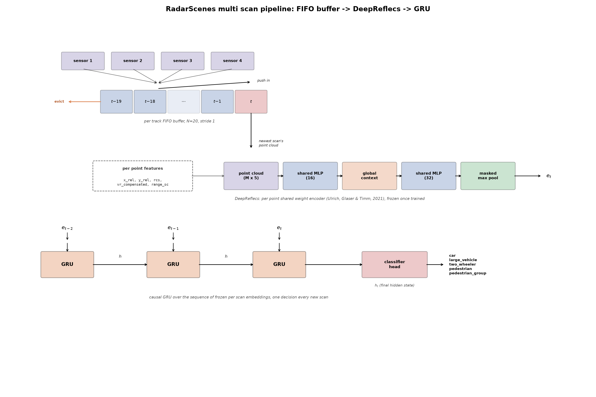
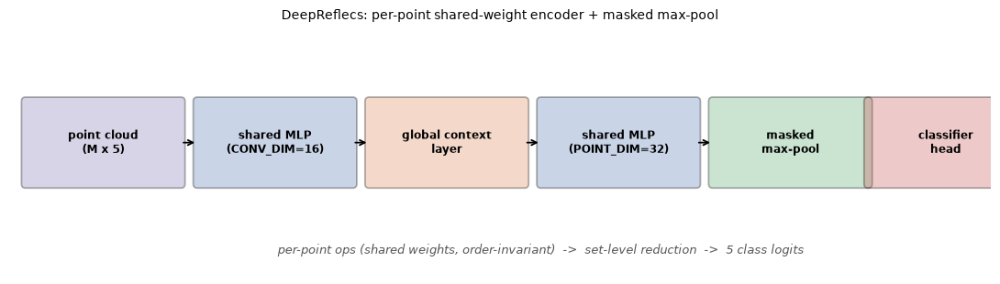
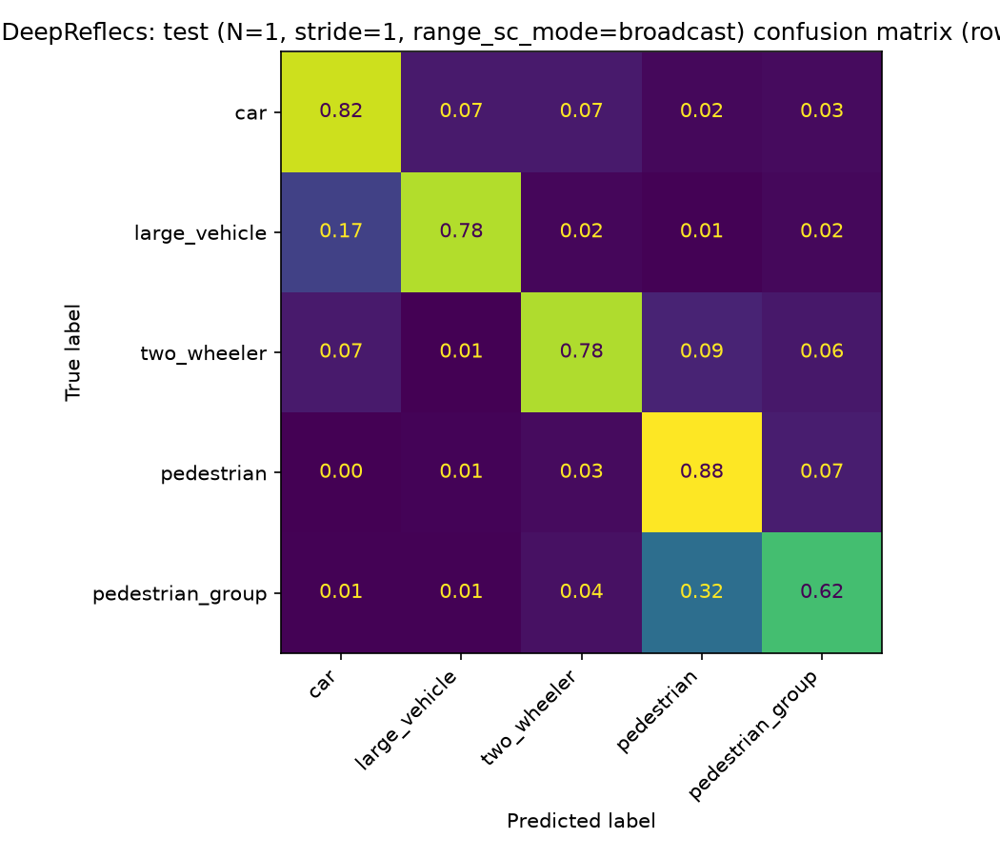
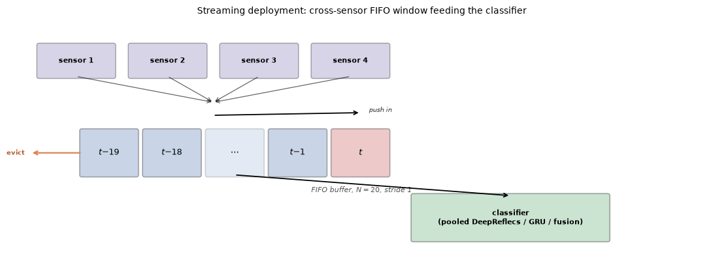
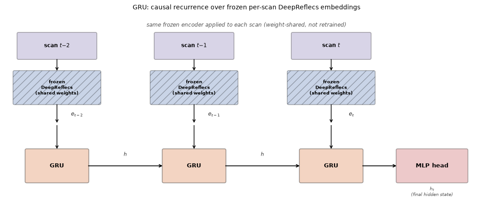
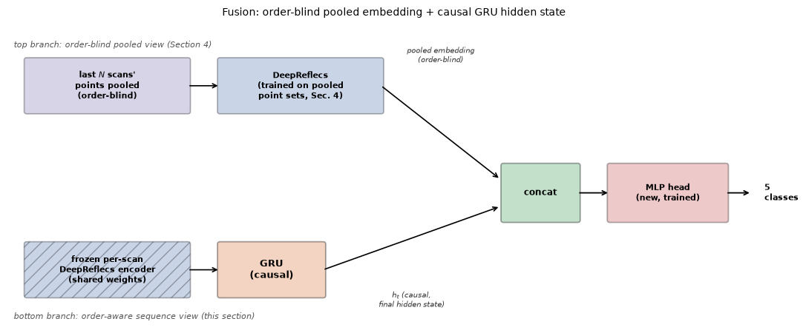

# RadarScenes Object Classification: From Single Scan to Multi-Scan Tracks

## Abstract

A single RadarScenes detection instance (one object, one scan) averages only ~2.9
points. A DeepReflecs point-set classifier trained on single scans (all 4 sensors)
scored 0.7370 macro F1 across the five target classes (`car`, `large_vehicle`,
`two_wheeler`, `pedestrian`, `pedestrian_group`), a sparsity ceiling, not a model
capacity one. That motivates accumulating a tracked object's points across its last
N radar scans instead of classifying each scan in isolation.

A naive pooled baseline (DeepReflecs, N=20 scans, all sensors, no notion of scan
order at all) already reaches 0.8613 macro F1 purely from extra points.
The best result (0.8897 macro F1) comes from a causal GRU that consumes the sequence of
per-scan embeddings directly (order-aware, one hidden state per track), fused with
the order-blind pooled embedding through a small trained classifier head. The full
pipeline is shown in Figure 1.

The fusion model's confusion matrix shows two dominant error axes: 15% of
`large_vehicle` tracks get misclassified as `car` (the reverse barely happens, 3.8%),
and `pedestrian`/`pedestrian_group` confuse each other in both directions (6.6% and
8.6%), consistent with those being genuinely ambiguous radar signatures (a large car
vs. a small truck; one individual person vs. a group) rather than a model-specific
weakness.




**Figure 1.** Multi-scan pipeline: per-track FIFO buffer feeding a frozen DeepReflecs encoder, whose per-scan embeddings drive a causal GRU.

## 1. The RadarScenes dataset

[RadarScenes](https://radar-scenes.com/) (Schumann et al., *RadarScenes: A Real-World
Radar Point Cloud Data Set for Automotive Applications*, arXiv:2104.02493, 2021) is a
real-world automotive radar dataset: 4 series-production radar sensors mounted on a
test vehicle, overlapping fields of view (Figure 2), point-level semantic labels
propagated from camera-verified object tracks.


This project's taxonomy merges RadarScenes' own finer-grained labels into 5 classes
(`car`, `large_vehicle`, `two_wheeler`, `pedestrian`, `pedestrian_group`); `large_vehicle`
folds in `truck`/`train`/`bus` (near-chance pairwise separability from `car`-sized
vehicles at the raw-class level, and `train`/`bus` individually too thin to split
without leakage). All 4 sensors share one global clock.


**Figure 2.** RadarScenes sensor layout, sensor 2 highlighted.

## 2. Single-scan baseline: DeepReflecs

DeepReflecs (Ulrich, Glaser & Timm, *DeepReflecs: Deep Learning for Automotive Object
Classification with Radar Reflections*, IEEE RadarConf 2021,
[arXiv:2010.09273](https://arxiv.org/abs/2010.09273)) is a per-point shared-weight
network (PointNet-style): the same small MLP processes every point independently, so
the model is order-invariant and works on a variable number of points by
construction. This project adapts its input features to what RadarScenes provides (`x_rel`, `y_rel`,
`rcs`, `vr_compensated`, `range_sc`), not a literal reproduction of the paper's own
feature set.

What sets it apart from a plain PointNet baseline: the **global context layer** sits
*between* the two per-point stages, not only at the very end, so the second per-point
layer already has access to a permutation-invariant summary (mean/max) of the whole
point set before producing its own output. A **masked global max-pool** then reduces
the (variable-length) point set to one fixed embedding, invariant to how many padding points get added,
picking out the most salient reading per channel regardless of point count (Figure 3).


```python

import matplotlib.pyplot as plt
import matplotlib.patches as mpatches

fig, ax = plt.subplots(figsize=(11, 3.2))
ax.set_xlim(0, 12)
ax.set_ylim(0, 3)
ax.axis("off")

stages = [
    (0.2, 1.6, "point cloud\n(M x 5)", "#8172B2"),
    (2.3, 1.6, "shared MLP\n(CONV_DIM=16)", "#4C72B0"),
    (4.4, 1.6, "global context\nlayer", "#DD8452"),
    (6.5, 1.6, "shared MLP\n(POINT_DIM=32)", "#4C72B0"),
    (8.6, 1.6, "masked\nmax-pool", "#55A868"),
    (10.5, 1.6, "classifier\nhead", "#C44E52"),
]
w, h = 1.9, 1.0
for x, y, label, color in stages:
    ax.add_patch(mpatches.FancyBboxPatch((x, y - h / 2), w, h, boxstyle="round,pad=0.05",
                                           linewidth=1.3, edgecolor="k", facecolor=color, alpha=0.3))
    ax.text(x + w / 2, y, label, ha="center", va="center", fontsize=8.5, fontweight="bold")

for (x1, y1, _, _), (x2, y2, _, _) in zip(stages[:-1], stages[1:]):
    ax.annotate("", xy=(x2, y2), xytext=(x1 + w, y1), arrowprops=dict(arrowstyle="->", color="k", lw=1.3))

ax.text(6.5, 0.3, "per-point ops (shared weights, order-invariant)  ->  set-level reduction  ->  5 class logits",
        ha="center", va="center", fontsize=9, style="italic", color="#555")
ax.set_title("DeepReflecs: per-point shared-weight encoder + masked max-pool", fontsize=10)
fig.tight_layout()
plt.show()

```


    

    


**Figure 3.** DeepReflecs: two per-point shared-weight MLP stages with a global context layer between them, followed by a masked max pool and classifier head.


```python

import json
from pathlib import Path
from IPython.display import Image, display

RESULTS = Path("/home/bruno/radar_machine_learning_ws/results")

metrics = json.loads((RESULTS / "track_accumulation/N1_stride1_allsensors/deepreflecs_test_metrics.json").read_text())
macro_f1 = sum(m["f1"] for m in metrics.values()) / len(metrics)
for c, m in metrics.items():
    print(f"{c:<18}{m['precision']:>10.3f}{m['recall']:>10.3f}{m['f1']:>10.3f}{m['support']:>10}")
print(f"\nmacro F1: {macro_f1:.4f}")

display(Image(filename=str(RESULTS / "track_accumulation/N1_stride1_allsensors/deepreflecs_test_confusion_matrix.png")))

```

    car                    0.942     0.816     0.874     76572
    large_vehicle          0.676     0.782     0.725     15555
    two_wheeler            0.522     0.777     0.625     11466
    pedestrian             0.664     0.884     0.758     35091
    pedestrian_group       0.810     0.621     0.703     40081
    
    macro F1: 0.7370


    

    


**Figure 4.** Single-scan (N=1, all sensors) confusion matrix, row-normalized.

**Single-scan baseline: macro F1 = 0.7370.** `car` is the strongest class (F1
0.874, most points per instance, most rigid/consistent signature); `two_wheeler` is
the weakest (F1 0.625, sparsest class, easily confused with `car`/`pedestrian` at
this point-count regime). This is the floor every multi-scan result below improves
on (Figure 4).

## 3. Motivation: why accumulate scans

- A single detection instance averaging ~2.9 points hits a hard ceiling regardless of
  encoder: histograms, explicit per-instance statistics (median, max, min, spread), and DeepReflecs' learned
  point-set network all converge to a similar macro F1 band on single-scan data
  (Section 2). The bottleneck is point count, not model choice.
- Beyond raw point count, a tracked object's radar signature evolves scan to scan:
  a pedestrian's micro-Doppler shifts as limbs swing, and RCS fluctuates as an
  object's dominant reflectors change with aspect angle. None of that is visible in
  a single scan, motivating a sequence model over the per-scan embeddings (Section 5)
  in addition to simply pooling more points.
- A `track_id` persists across a tracked object's lifetime, multiple radar scans of
  the *same* object, and all 4 sensors share one global clock. Pooling a track's last
  N scans' points into one decision, instead of one scan's points, attacks sparsity
  directly at the input level rather than trying to encode more out of the same few
  points.
- A second, independent factor: building a window from whichever sensor(s) are
  actually detecting the track *right now* (cross-sensor handoff) gets more real
  detections per track without needing more real time to pass, since a track is
  often seen by 2-3 different sensors as it moves through overlapping fields of
  view.
- Coordinate frame: the car frame (`x_cc`/`y_cc`) rotates with ego heading and is unusable across scans; the
  global odometry-corrected frame (`x_seq`/`y_seq`), recentered per scan on that
  scan's own object centroid (`x_rel`/`y_rel` = `x_seq`/`y_seq` minus that scan's
  own mean), is what actually goes into the model, bounded scan-to-scan instead of
  drifting with the object's accumulated path.

## 4. Multi-scan baseline: naive pooling

All points from a track's last `N=20` scans (all sensors) concatenated into **one**
point set, classified by a single DeepReflecs instance trained end-to-end on the
pooled data. No sequence model, no per-scan structure retained, no notion of which
point came from which scan at all.

In deployment this window is a per-track FIFO buffer: each new scan pushes in and
the oldest one drops out, so the buffer always holds exactly the last N scans and a
decision fires the moment a new scan arrives (Figure 5).


```python
import matplotlib.pyplot as plt
import matplotlib.patches as mpatches

fig, ax = plt.subplots(figsize=(11, 4.0))
ax.set_xlim(0, 12)
ax.set_ylim(0, 4.3)
ax.axis("off")

# 4 sensors feeding in
sensor_xs = [1.0, 2.6, 4.2, 5.8]
w_sens, h_sens = 1.3, 0.6
sens_y = 3.3
for i, x in enumerate(sensor_xs):
    ax.add_patch(mpatches.FancyBboxPatch((x - w_sens / 2, sens_y), w_sens, h_sens, boxstyle="round,pad=0.04",
                                          linewidth=1.1, edgecolor="k", facecolor="#8172B2", alpha=0.3))
    ax.text(x, sens_y + h_sens / 2, f"sensor {i + 1}", ha="center", va="center", fontsize=7.8, fontweight="bold")

merge_x, merge_y = 3.4, 2.55
for x in sensor_xs:
    ax.annotate("", xy=(merge_x, merge_y + 0.25), xytext=(x, sens_y),
                arrowprops=dict(arrowstyle="->", color="k", lw=0.9, alpha=0.6))

# FIFO buffer: last N=20 scans, oldest (left) evicted as newest (right) arrives
buf_y = 1.4
buf_w, buf_h = 0.95, 0.85
buf_labels = ["$t{-}19$", "$t{-}18$", "$\\cdots$", "$t{-}1$", "$t$"]
n_slots = len(buf_labels)
buf_x0 = 1.1
xs_buf = [buf_x0 + i * (buf_w + 0.15) for i in range(n_slots)]

for x, label in zip(xs_buf, buf_labels):
    is_ellipsis = label == "$\\cdots$"
    is_newest = label == "$t$"
    color = "#C44E52" if is_newest else "#4C72B0"
    ax.add_patch(mpatches.FancyBboxPatch((x, buf_y), buf_w, buf_h, boxstyle="round,pad=0.04",
                                          linewidth=1.2, edgecolor="k", facecolor=color,
                                          alpha=0.15 if is_ellipsis else 0.3))
    ax.text(x + buf_w / 2, buf_y + buf_h / 2, label, ha="center", va="center", fontsize=9, fontweight="bold")

ax.annotate("", xy=(xs_buf[-1] + buf_w / 2, buf_y + buf_h + 0.35), xytext=(merge_x, merge_y),
            arrowprops=dict(arrowstyle="->", color="k", lw=1.3))
ax.text(xs_buf[-1] + buf_w / 2 + 0.15, buf_y + buf_h + 0.4, "push in", ha="left", va="center",
        fontsize=7.5, style="italic", color="#333")

evict_x = xs_buf[0] - 0.15
ax.annotate("", xy=(evict_x - 0.75, buf_y + buf_h / 2), xytext=(xs_buf[0], buf_y + buf_h / 2),
            arrowprops=dict(arrowstyle="->", color="#DD8452", lw=1.6))
ax.text(evict_x - 0.85, buf_y + buf_h / 2, "evict", ha="right", va="center",
        fontsize=7.5, color="#B35A2A", fontweight="bold")

ax.text(6.0, buf_y - 0.3, "FIFO buffer, $N=20$, stride 1", ha="center", va="center", fontsize=8,
        style="italic", color="#555")

# feeds into the model (pooled / GRU / fusion, whichever this section is discussing)
w_model, h_model = 3.4, 0.85
model_x = 8.6
model_y = 0.15
ax.add_patch(mpatches.FancyBboxPatch((model_x - w_model / 2, model_y), w_model, h_model, boxstyle="round,pad=0.04",
                                      linewidth=1.3, edgecolor="k", facecolor="#55A868", alpha=0.3))
ax.text(model_x, model_y + h_model / 2, "classifier\n(pooled DeepReflecs / GRU / fusion)",
        ha="center", va="center", fontsize=8, fontweight="bold")
ax.annotate("", xy=(model_x, model_y + h_model), xytext=((xs_buf[0] + xs_buf[-1] + buf_w) / 2, buf_y),
            arrowprops=dict(arrowstyle="->", color="k", lw=1.3))

ax.set_title("Streaming deployment: cross-sensor FIFO window feeding the classifier", fontsize=10, pad=12)
fig.tight_layout()
plt.show()
```


    

    


**Figure 5.** Streaming deployment: the cross-sensor FIFO window feeding the classifier.


```python

metrics = json.loads((RESULTS / "track_accumulation/N20_stride1_allsensors/deepreflecs_test_metrics.json").read_text())
macro_f1 = sum(m["f1"] for m in metrics.values()) / len(metrics)
for c, m in metrics.items():
    print(f"{c:<18}{m['precision']:>10.3f}{m['recall']:>10.3f}{m['f1']:>10.3f}{m['support']:>10}")
print(f"\nmacro F1: {macro_f1:.4f}")

display(Image(filename=str(RESULTS / "track_accumulation/N20_stride1_allsensors/deepreflecs_test_confusion_matrix.png")))

```

    car                    0.953     0.909     0.930     76572
    large_vehicle          0.798     0.832     0.815     15555
    two_wheeler            0.744     0.884     0.808     11466
    pedestrian             0.867     0.919     0.892     35091
    pedestrian_group       0.877     0.846     0.861     40081
    
    macro F1: 0.8613


    

    


**Figure 6.** Multi-scan pooled baseline (N=20, all sensors) confusion matrix, row-normalized.

**Baseline: macro F1 = 0.8613**, +0.1243 over the single-scan floor from pooling
alone, no new architecture. Weakest class is still `two_wheeler` (F1 0.813), but
every class improved substantially over Section 2's single-scan numbers (Figure 6).

## 5. Sequence model: GRU, and fusion with the pooled view

A frozen, already-trained DeepReflecs encoder reduces each scan to one embedding
vector; a GRU then consumes the sequence of a track's embeddings causally (a verdict at scan t only depends on scans up to and
including t, so it stays usable in real-time streaming inference). The encoder runs
once per scan across the whole dataset, not once per window, so a sliding window's
scan-to-scan overlap costs nothing extra in encoder compute (Figure 7).


```python
import matplotlib.pyplot as plt
import matplotlib.patches as mpatches

fig, ax = plt.subplots(figsize=(11, 4.6))
ax.set_xlim(0, 12)
ax.set_ylim(0, 5.1)
ax.axis("off")

ax.text(6.0, 4.9, "same frozen encoder applied to each scan (weight-shared, not retrained)",
        ha="center", va="center", fontsize=8.5, style="italic", color="#555")

xs = [1.3, 4.7, 8.1]
scan_labels = ["scan $t{-}2$", "scan $t{-}1$", "scan $t$"]
w_scan, h_scan = 1.9, 0.7
scan_y = 3.95

for x, label in zip(xs, scan_labels):
    ax.add_patch(mpatches.FancyBboxPatch((x - w_scan / 2, scan_y), w_scan, h_scan, boxstyle="round,pad=0.04",
                                          linewidth=1.2, edgecolor="k", facecolor="#8172B2", alpha=0.3))
    ax.text(x, scan_y + h_scan / 2, label, ha="center", va="center", fontsize=8.5, fontweight="bold")

w_enc, h_enc = 2.1, 0.9
enc_y = 2.65
for x in xs:
    ax.add_patch(mpatches.FancyBboxPatch((x - w_enc / 2, enc_y), w_enc, h_enc, boxstyle="round,pad=0.04",
                                          linewidth=1.2, edgecolor="k", facecolor="#4C72B0", alpha=0.3,
                                          hatch="//"))
    ax.text(x, enc_y + h_enc / 2, "frozen\nDeepReflecs\n(shared weights)", ha="center", va="center",
            fontsize=7.3, fontweight="bold")
    ax.annotate("", xy=(x, enc_y + h_enc), xytext=(x, scan_y), arrowprops=dict(arrowstyle="->", color="k", lw=1.1))

emb_y = 2.05
for x, t in zip(xs, ["$e_{t-2}$", "$e_{t-1}$", "$e_t$"]):
    ax.annotate("", xy=(x, emb_y), xytext=(x, enc_y), arrowprops=dict(arrowstyle="->", color="k", lw=1.1))
    ax.text(x + 0.5, emb_y + 0.28, t, ha="center", va="center", fontsize=8.5, style="italic", color="#333")

w_gru, h_gru = 1.5, 0.9
gru_y = 0.85
for i, x in enumerate(xs):
    ax.add_patch(mpatches.FancyBboxPatch((x - w_gru / 2, gru_y - h_gru / 2), w_gru, h_gru, boxstyle="round,pad=0.04",
                                          linewidth=1.3, edgecolor="k", facecolor="#DD8452", alpha=0.35))
    ax.text(x, gru_y, "GRU", ha="center", va="center", fontsize=9.5, fontweight="bold")
    ax.annotate("", xy=(x, gru_y + h_gru / 2), xytext=(x, emb_y),
                arrowprops=dict(arrowstyle="->", color="k", lw=1.1))
    if i > 0:
        x_prev = xs[i - 1]
        ax.annotate("", xy=(x - w_gru / 2, gru_y), xytext=(x_prev + w_gru / 2, gru_y),
                    arrowprops=dict(arrowstyle="->", color="k", lw=1.3))
        ax.text((x_prev + x) / 2, gru_y + 0.32, "$h$", ha="center", va="center", fontsize=8, style="italic", color="#333")

w_mlp, h_mlp = 1.7, 0.9
mlp_x = 10.6
ax.add_patch(mpatches.FancyBboxPatch((mlp_x - w_mlp / 2, gru_y - h_mlp / 2), w_mlp, h_mlp, boxstyle="round,pad=0.04",
                                      linewidth=1.3, edgecolor="k", facecolor="#C44E52", alpha=0.3))
ax.text(mlp_x, gru_y, "MLP head", ha="center", va="center", fontsize=9, fontweight="bold")
ax.annotate("", xy=(mlp_x - w_mlp / 2, gru_y), xytext=(xs[-1] + w_gru / 2, gru_y),
            arrowprops=dict(arrowstyle="->", color="k", lw=1.3))
ax.text(mlp_x, gru_y - 0.75, "$h_t$\n(final hidden state)", ha="center", va="center", fontsize=7.3,
        style="italic", color="#555")

ax.set_title("GRU: causal recurrence over frozen per-scan DeepReflecs embeddings", fontsize=10, pad=14)
fig.tight_layout()
plt.show()
```


    

    


**Figure 7.** GRU: causal recurrence over frozen per-scan DeepReflecs embeddings.

**Fusion** concatenates this GRU's final hidden state (order-aware) with the pooled,
order-blind embedding from Section 4's baseline, then trains a small classifier head
on the concatenation, both branches frozen. Structurally analogous to a U-Net skip
connection (Ronneberger, Fischer & Brox, MICCAI 2015): splice in a view the deeper
path's own bottleneck might otherwise discard, instead of forcing one representation
to carry everything (Figure 8).


```python
import matplotlib.pyplot as plt
import matplotlib.patches as mpatches

fig, ax = plt.subplots(figsize=(11, 4.6))
ax.set_xlim(0, 12)
ax.set_ylim(0, 4.9)
ax.axis("off")

ax.text(0.1, 4.65, "top branch: order-blind pooled view (Section 4)", ha="left", va="center",
        fontsize=8, style="italic", color="#555")
ax.text(0.1, 0.15, "bottom branch: order-aware sequence view (this section)", ha="left", va="center",
        fontsize=8, style="italic", color="#555")

# top branch: pooled, order-blind
w1, h1 = 2.5, 0.85
top_y = 3.55
ax.add_patch(mpatches.FancyBboxPatch((0.3, top_y), w1, h1, boxstyle="round,pad=0.04",
                                      linewidth=1.2, edgecolor="k", facecolor="#8172B2", alpha=0.3))
ax.text(0.3 + w1 / 2, top_y + h1 / 2, "last $N$ scans'\npoints pooled\n(order-blind)",
        ha="center", va="center", fontsize=7.8, fontweight="bold")

w2, h2 = 2.5, 0.85
x2 = 3.3
ax.add_patch(mpatches.FancyBboxPatch((x2, top_y), w2, h2, boxstyle="round,pad=0.04",
                                      linewidth=1.2, edgecolor="k", facecolor="#4C72B0", alpha=0.3))
ax.text(x2 + w2 / 2, top_y + h2 / 2, "DeepReflecs\n(trained on pooled\npoint sets, Sec. 4)",
        ha="center", va="center", fontsize=7.8, fontweight="bold")
ax.annotate("", xy=(x2, top_y + h2 / 2), xytext=(0.3 + w1, top_y + h1 / 2),
            arrowprops=dict(arrowstyle="->", color="k", lw=1.2))

# bottom branch: per-scan frozen encoder + GRU (causal)
w3, h3 = 2.5, 0.85
bot_y = 0.5
ax.add_patch(mpatches.FancyBboxPatch((0.3, bot_y), w3, h3, boxstyle="round,pad=0.04",
                                      linewidth=1.2, edgecolor="k", facecolor="#4C72B0", alpha=0.3, hatch="//"))
ax.text(0.3 + w3 / 2, bot_y + h3 / 2, "frozen per-scan\nDeepReflecs encoder\n(shared weights)",
        ha="center", va="center", fontsize=7.8, fontweight="bold")

w4, h4 = 1.6, 0.85
x4 = 3.3
ax.add_patch(mpatches.FancyBboxPatch((x4, bot_y), w4, h4, boxstyle="round,pad=0.04",
                                      linewidth=1.3, edgecolor="k", facecolor="#DD8452", alpha=0.35))
ax.text(x4 + w4 / 2, bot_y + h4 / 2, "GRU\n(causal)", ha="center", va="center", fontsize=9, fontweight="bold")
ax.annotate("", xy=(x4, bot_y + h4 / 2), xytext=(0.3 + w3, bot_y + h3 / 2),
            arrowprops=dict(arrowstyle="->", color="k", lw=1.2))

# converging arrows into concat, with labels offset above/below the lines (not on them)
concat_x, concat_y, wc, hc = 7.7, 1.75, 1.15, 0.9
top_start = (x2 + w2, top_y + h2 / 2)
bot_start = (x4 + w4, bot_y + h4 / 2)
concat_top_in = (concat_x - 0.05, concat_y + hc * 0.75)
concat_bot_in = (concat_x - 0.05, concat_y + hc * 0.25)

ax.annotate("", xy=concat_top_in, xytext=top_start, arrowprops=dict(arrowstyle="->", color="k", lw=1.2))
ax.text((top_start[0] + concat_top_in[0]) / 2, top_start[1] + 0.35, "pooled embedding\n(order-blind)",
        ha="center", va="bottom", fontsize=7.3, style="italic", color="#333")

ax.annotate("", xy=concat_bot_in, xytext=bot_start, arrowprops=dict(arrowstyle="->", color="k", lw=1.2))
ax.text((bot_start[0] + concat_bot_in[0]) / 2, bot_start[1] - 0.35, "$h_t$ (causal,\nfinal hidden state)",
        ha="center", va="top", fontsize=7.3, style="italic", color="#333")

ax.add_patch(mpatches.FancyBboxPatch((concat_x, concat_y), wc, hc, boxstyle="round,pad=0.04",
                                      linewidth=1.3, edgecolor="k", facecolor="#55A868", alpha=0.35))
ax.text(concat_x + wc / 2, concat_y + hc / 2, "concat", ha="center", va="center", fontsize=8.5, fontweight="bold")

w5, h5 = 1.8, 0.9
x5 = concat_x + wc + 0.5
ax.add_patch(mpatches.FancyBboxPatch((x5, concat_y), w5, h5, boxstyle="round,pad=0.04",
                                      linewidth=1.3, edgecolor="k", facecolor="#C44E52", alpha=0.3))
ax.text(x5 + w5 / 2, concat_y + h5 / 2, "MLP head\n(new, trained)", ha="center", va="center",
        fontsize=8, fontweight="bold")
ax.annotate("", xy=(x5, concat_y + h5 / 2), xytext=(concat_x + wc, concat_y + hc / 2),
            arrowprops=dict(arrowstyle="->", color="k", lw=1.3))

ax.annotate("", xy=(11.55, concat_y + h5 / 2), xytext=(x5 + w5, concat_y + h5 / 2),
            arrowprops=dict(arrowstyle="->", color="k", lw=1.3))
ax.text(11.75, concat_y + h5 / 2, "5\nclasses", ha="left", va="center", fontsize=8, fontweight="bold")

ax.set_title("Fusion: order-blind pooled embedding + causal GRU hidden state, both frozen", fontsize=10, pad=14)
fig.tight_layout()
plt.show()
```


    

    


**Figure 8.** Fusion: order-blind pooled embedding concatenated with the causal GRU's hidden state, both branches frozen.


```python

metrics_gru = json.loads((RESULTS / "track_accumulation_rnn/N20_stride1_gru_h64_allsensors/gru_test_metrics.json").read_text())
macro_f1_gru = sum(m["f1"] for m in metrics_gru.values()) / len(metrics_gru)
print("GRU alone:")
for c, m in metrics_gru.items():
    print(f"{c:<18}{m['precision']:>10.3f}{m['recall']:>10.3f}{m['f1']:>10.3f}{m['support']:>10}")
print(f"macro F1: {macro_f1_gru:.4f}\n")

metrics_fusion = json.loads((RESULTS / "track_accumulation_rnn/N20_stride1_fusion_pooled_gru64_allsensors/fusion_test_metrics.json").read_text())
macro_f1_fusion = sum(m["f1"] for m in metrics_fusion.values()) / len(metrics_fusion)
print("Fusion (pooled + GRU h=64):")
for c, m in metrics_fusion.items():
    print(f"{c:<18}{m['precision']:>10.3f}{m['recall']:>10.3f}{m['f1']:>10.3f}{m['support']:>10}")
print(f"macro F1: {macro_f1_fusion:.4f}")

display(Image(filename=str(RESULTS / "track_accumulation_rnn/N20_stride1_fusion_pooled_gru64_allsensors/fusion_test_confusion_matrix.png")))

```

    GRU alone:
    car                    0.952     0.935     0.944     76572
    large_vehicle          0.817     0.841     0.829     15555
    two_wheeler            0.844     0.909     0.875     11466
    pedestrian             0.895     0.905     0.900     35091
    pedestrian_group       0.904     0.895     0.900     40081
    macro F1: 0.8895
    
    Fusion (pooled + GRU h=64):
    car                    0.953     0.933     0.943     76572
    large_vehicle          0.810     0.845     0.827     15555
    two_wheeler            0.849     0.906     0.877     11466
    pedestrian             0.888     0.914     0.901     35091
    pedestrian_group       0.910     0.890     0.900     40081
    macro F1: 0.8897


    

    


**Figure 9.** Fusion model (N=20, all sensors) confusion matrix, row-normalized.

**GRU alone: macro F1 = 0.8895** (+0.0260 over the pooling baseline). **Fusion:
macro F1 = 0.8897** (+0.0002 over GRU alone, within this branch's own noise band for
a single split, not a real additional gain). The best overall result either way.

**Confusion matrix, fusion model (Figure 9).** Two dominant error axes: `large_vehicle` -> `car`
at 15% (the reverse direction is only 3.8%), and `pedestrian` <-> `pedestrian_group`
confuse each other both ways (6.6% and 8.6%). Both read as genuinely ambiguous radar
signatures, a large car and a small truck, or one person and a loose group, rather
than a fixable model weakness: `car` is the class every `large_vehicle` error falls
into, and the pedestrian/group confusion is symmetric, not a one-directional bias.

## 6. Ablation studies

Everything below is single-split, not fold-validated: a proper 6-fold sweep at this scale takes roughly a full day of compute per configuration, not run here for every variant in this table.

| what was tried | result vs. its own reference | reads as |
|---|---|---|
| More GRU capacity (h=128) | Worse or flat vs. h=64 at every N/sensor scale tested | Not capacity-starved; more parameters overfit rather than help |
| Temporal-variation scalar (scan-to-scan RCS/Doppler diff) added to the pooled or GRU representation | Small, inconsistent gains (+0.001 to +0.013 depending on N/sensor), never large | Genuine but marginal signal, sensitive to how it's normalized across cross-sensor time gaps |
| End-to-end fine-tuning (warmstart) of either the pooled encoder or the GRU's own per-scan encoder, at N=20 all-sensor | Both land *below* their frozen baselines (-0.0029, -0.0017) | An already-good frozen encoder already sits near this task's ceiling; the one N=10 sensor2-only warmstart win doesn't generalize to this scale |
| Post-hoc probability smoothing (causal, along a track) on the fusion model's output | Small positive: +0.0013 (moving average, K=5) to +0.0031 (IIR low-pass, same span) | Free accuracy at inference time, not a training-time fix |
| Other sequence-mixing architectures (Transformer, a selective state-space model, point-level self-attention), same frozen per-scan embeddings | All land inside the same ~0.86 to 0.89 macro F1 band as GRU/fusion | The bottleneck is upstream of which sequence-mixing mechanism is used, not solved by trying a different one |

All models/architectures GRU, GRU h=128, Transformer d=32, Mamba, point-level self-attention, all trained on the same frozen per-scan embeddings, land within 0.86 to 0.89 macro F1 of each other, a 0.03 spread. End-to-end fine-tuning of the encoder itself (warmstart) moved the number by −0.0017 to −0.0029. By contrast, the two changes made upstream of any sequence model, pooling scans instead of classifying one (0.7370 → 0.8613, +0.1243) and adding a GRU over per-scan embeddings at all (+0.0282), are 10 to 50x larger than anything gained or lost by changing the sequence-mixing mechanism itself. Given a fixed frozen per-scan embedding, no downstream architecture choice tested here moves macro F1 by more than ~0.003; the embedding itself, not the mechanism consuming it, is the binding constraint on further gains.

## 7. Conclusions and future work

Multi-scan accumulation improved the performance significantly: pooling alone recovers most of the gap
from the single-scan floor (0.7370 -> 0.8613), and a causal GRU plus fusion recovers
a further, smaller amount (-> 0.8897). Architecture search *within* the sequence-mixing
stage (capacity, warmstarting, alternative mechanisms) has consistently returned the
same answer, further gains there are not where the remaining headroom is.

**Concrete next steps, in order of expected information gained per hour spent:**

1. **Fold-validate the current best configuration.** Every number in this report is
   a single split; the branch's own repeated finding is that differences under
   roughly a point should be read as ties, not ranked results, without this check.
2. **Error overlap analysis.** Cross-reference the fusion model's misclassified
   tracks against GRU alone and the other architectures tried. If the same tracks
   are wrong everywhere, the ceiling is in the data/labels, not any one model.
3. **Manual inspection of the confusion matrix**, especially `large_vehicle` predicted as
   `car` and `pedestrian` vs. `pedestrian_group`, directly against the raw point
   clouds and RadarScenes ground truth, since both read as plausibly ambiguous even
   to a human annotator.
4. **Question the frozen per-scan embedding itself.** Every sequence model shares the
   same frozen DeepReflecs per-scan encoder as input; if that encoder is the actual
   bottleneck, no amount of downstream sequence-mixing sophistication will move the
   number.
